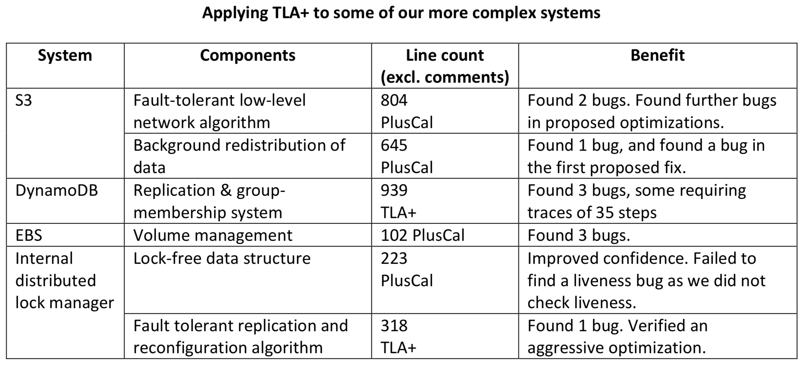

# Part 0 (Intro)
## Verification of distributed systems
Distributed storage and processing systems are a key component of modern scalable web services.

For example:
* Amazon Uses Dynamo to Implement Shopping Cart
* Google uses BigTable in Gmail
* LinkedIn uses Kafka to transport user data

For such systems, correctness is critical: due to an error at the storage level, the user of the service can lose his money, messages or other important data.

Writing correct code for distributed systems is incredibly difficult because there are many factors to consider: concurrency, asynchrony, lost messages, node failures. Therefore, one of the main problems for such systems is *verification* -- checking the system for compliance with a set of requirements (for example: after confirming the data, the system has no right to lose it).

### Standard Approaches
The industry uses several standard methods for verifying distributed systems:

* Design review -- developers describe system components and their interaction protocol in order to detect possible errors at the design stage, before writing code
* Testing
* Code review -- after passing all handwritten tests, developers try to find bugs by reviewing new code

But these methods are not enough. The reason is that it is difficult for a person to simulate all possible executions of a distributed system in his head, it is easy for him to miss a difficult race for design reviews, code reviews, or when writing a test.

This idea is confirmed by engineers from Amazon [4]:
> We use deep design reviews, code reviews, static code analysis, stress testing, fault-injection testing, and many other techniques, but we still find that subtle bugs can hide in complex concurrent fault-tolerant systems. One reason for this problem is that human intuition is poor at estimating the true probability of supposedly ‘extremely rare’ combinations of events in systems operating at a scale of millions of requests per second ...

There is a randomized approach to testing - fault injection. To cover as many non-trivial executions as possible, failures (node ​​restarts, delays or network partitions) are introduced into the system code or runtime, which are triggered at arbitrary moments in time.

But this method does not guarantee that very rare scenarios will be detected.

AWS engineers conclude:
> We have found that testing the code is inadequate as a method to find subtle errors in design, as the number of reachable states of the code is astronomical. So we looked for a better approach.

## Formal methods
An alternative approach to verification ("better approach", which is discussed above) - formal methods.

*Formal verification* is the construction of a logical model of the system and its analysis by means of mathematical logic.

Basic concepts used by formal verification:
* *State Machine* -- a time-varying state, which is described by a set of variables
* *State* of the machine -- assigning values ​​to these variables
* *Behavior* or *trajectory* -- an infinite sequence of states
* *Specification* or *spec* -- a declarative description of all system behaviors (states and transitions between them)
* *Property (Property)* -- a set of permissible system behaviors, usually expressed as a temporal logic formula

A specification is a strict, formal analogue of a design document.

The task of *model checking* is to examine the system state graph and check the specified properties.

### TLA+
One of the most popular implementations of this approach is the TLA+ language developed by Leslie Lamport and the TLC - model checker for it.

TLA+ is a formal specification language based on untyped set theory, first-order logic, and temporal logic, which Lamport calls *TLA (Temporal Logic of Actions)*.

A typical specification for formal verification on TLA+ looks like this:
```
Spec == Init /\ []Next
```

Where:
* Init -- predicate that sets the set of initial states of the system
* Next -- predicate on pairs of states (*action*)
* [] -- temporal operator meaning "always"

Properties in TLA+ are specified by the formulas *LTL* - temporal logic of linear time.

Examples:

Starvation Freedom -- The mutex ensures that every thread hits the critical section infinitely often.
```
StarvationFreedom == \A t \in Thread: []<>(pc[t] = "CS")
```

Eventual Consistency -- All replicas will eventually converge to one state.
```
EventualConsistency == <>[] (\A i, j \in Regions : Database[i] = Database[j])
```

A good introduction to TLA+ is the Practical TLA book and video course by Leslie Lamport. And a good detailed reference is Specifying Systems.

### Modeling Distributed Systems
In this work, we will use TLA+ for the specification and verification of distributed systems.

TLA+ itself is in no way tied to distributedness, it does not operate with the concepts of this subject area. It is a logical "assembler" that can be used to describe arbitrary systems. But Lamport deliberately structured it in such a way that asynchrony and concurrency fit comfortably into it.

General scheme of representation of a distributed system in TLA+:
* The vertices in the state graph correspond to a “snapshot” of the entire system, they are formed by the state of all replicas in the system and the state of the network.
* Transitions between states correspond to the reaction of nodes to events: delivery of a message from another node, request or operation from a client, etc.

## TLA+ in the industry
TLA+ was developed by Leslie Lamport in 1999 as a tool for specifying his own algorithms, and was only used in academia.

Industry interest began with the article “Use of Formal Methods at Amazon Web Services”, in which AWS engineers shared their experience of formal verification of algorithms critical for cloud infrastructure: replication and reconfiguration protocols, lock-free algorithms, network protocols.



Now more and more large IT companies use TLA+ to verify their services:
* In Microsoft, Microsoft Azure cloud platform developers have specified the CosmosDB distributed database consistency models
* In Yandex, a complex A-B-A scenario of several dozen steps was reproduced in a lock-free memory allocator and the patch for this scenario was verified.
* Elastic used TLA+ to verify the document indexing algorithm and data replication protocol.

## ClickHouse
ClickHouse is a columnar database management system (DBMS) for online processing of analytical queries (OLAP). Developed by Yandex and the open-source community.

Tables in ClickHouse are scaled horizontally using sharding, and fault tolerance is ensured by replicating each of the shards.

## Objectives of work
The main task is to highlight general techniques for describing distributed systems and the model in which they operate:
* Investigate existing TLA+ specifications for distributed algorithms and industrial distributed systems.
* Highlight the general techniques for modeling distributed systems (modeling sections / components, networks, failures, working with TLC),
* Apply these techniques for a formal description of the replication algorithm and verification of log trimming algorithms and quorum records in ClickHouse.

## Specifications for the study
This paper will investigate specifications for the following algorithms and systems:
* Partition replication protocol in a distributed persistent message queue Apache Kafka
* Snapshot Isolation -- a transaction isolation algorithm running on top of a multiversion data store.
* Percolator -- client protocol for distributed transactions on top of BigTable distributed key/value storage, used at Google.
* Single Decree Paxos -- distributed consensus protocol, which is the basis for shard replication mechanism (tablets) in Google Spanner system.
* Raft is a command log replication protocol, a modern analogue of Paxos. It is used in MongoDB, InfluxDB and etcd

## Work plan
Chapter 1 will describe the principles for specifying distributed systems using TLA+:
* How to choose the desired level of detail for the system / algorithm
* Should I simulate crashes in specs
* How to model a network in algorithms that use communication through sending messages between nodes
* How TLA+ allows you to describe the non-determinism that occurs in the system.

Chapter 2 discusses the engineering aspects of formal verification:
* How to test the specification itself
* How to reduce the number of states in the configuration graph
* How to choose the appropriate mode for the model checker.

In Chapter 3, we will apply all the developed techniques for the formal specification and verification of the replication protocol in the ClickHouse distributed analytical database.